# Diagram Use Case, Alur Skenario & Diagram Aktivitas

**Campus Fitness & Gym Buddy Matcher**

*Draft — Pemodelan UML: Use Case Diagram, Linear-Sequence Use Case, dan Activity Diagram*

Dokumen ini memodelkan perilaku fungsional sistem Campus Fitness & Gym Buddy Matcher menggunakan notasi UML (Unified Modeling Language) standar OMG (Object Management Group): Use Case Diagram untuk menggambarkan cakupan sistem dan interaksi aktor, Linear-Sequence Use Case untuk mendokumentasikan alur normal dan alternatif/pengecualian setiap use case, serta Activity Diagram untuk memvisualisasikan logika proses tiap use case secara grafis.

Delapan use case utama dipilih sebagai representasi tiap modul fungsional (Manajemen Profil, Mesin Pencocokan, Komunikasi & Penjadwalan) ditambah satu use case Pengelola Gym dan satu use case Administrator Sistem, mengikuti struktur backlog pada Agile Framework Proposal. Empat use case tambahan (Verifikasi Akun, Hitung Skor Kecocokan, Blokir Pengguna, Laporkan Pengguna) muncul sebagai target relasi «include» dan «extend», masing-masing tetap dilengkapi diagram aktivitas sendiri.

## A. Diagram Use Case

Diagram berikut mengikuti standar UML OMG: aktor digambarkan sebagai stick-figure di luar batas sistem, use case sebagai elips di dalam batas sistem (system boundary), asosiasi sebagai garis lurus, dan relasi «include»/«extend» sebagai panah putus-putus terarah.

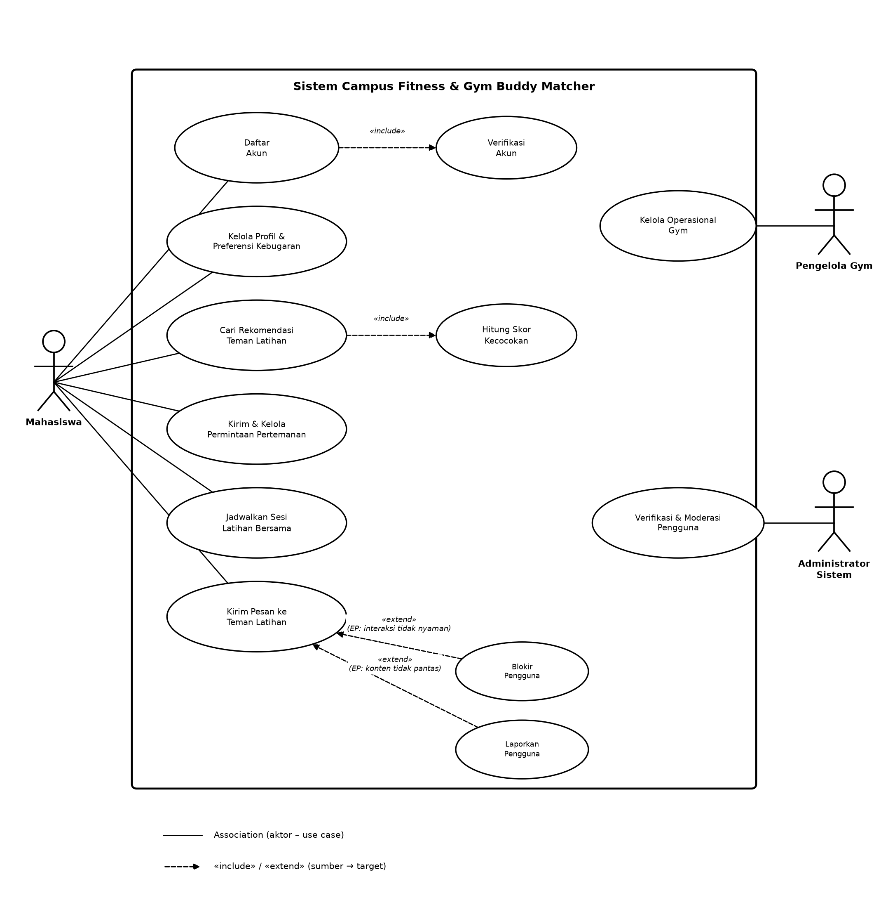

*Gambar A.1 — Use Case Diagram sistem Campus Fitness & Gym Buddy Matcher*

### A.1 Daftar Aktor

| **Aktor** | **Deskripsi** |
| --- | --- |
| Mahasiswa | Pengguna utama aplikasi yang mencari, mencocokkan, dan berinteraksi dengan teman latihan. |
| Pengelola Gym | Staf gym kampus yang mengelola informasi operasional dan melihat statistik penggunaan gym. |
| Administrator Sistem | Mengelola keamanan, verifikasi akun, moderasi laporan, dan konfigurasi data sistem. |

### A.2 Daftar Use Case & Penamaan Verb-Noun

| **ID** | **Use Case (Verb-Noun)** | **Aktor** | **Jenis Relasi** |
| --- | --- | --- | --- |
| UC-1 | Daftar Akun | Mahasiswa | Base — «include» UC-2 |
| UC-2 | Verifikasi Akun | Mahasiswa | Included oleh UC-1 |
| UC-3 | Kelola Profil & Preferensi Kebugaran | Mahasiswa | Base |
| UC-4 | Cari Rekomendasi Teman Latihan | Mahasiswa | Base — «include» UC-4b |
| UC-4b | Hitung Skor Kecocokan | Mahasiswa | Included oleh UC-4 |
| UC-5 | Kirim & Kelola Permintaan Pertemanan | Mahasiswa | Base |
| UC-6 | Jadwalkan Sesi Latihan Bersama | Mahasiswa | Base |
| UC-7 | Kirim Pesan ke Teman Latihan | Mahasiswa | Base — di-«extend» UC-7b, UC-7c |
| UC-7b | Blokir Pengguna | Mahasiswa | Extends UC-7 |
| UC-7c | Laporkan Pengguna | Mahasiswa | Extends UC-7 |
| UC-8 | Kelola Operasional Gym | Pengelola Gym | Base |
| UC-9 | Verifikasi & Moderasi Pengguna | Administrator Sistem | Base |

### A.3 Relasi Include / Extend

| **Relasi** | **Sumber → Target** | **Makna** | **Extension Point** |
| --- | --- | --- | --- |
| «include» | UC-1 Daftar Akun → UC-2 Verifikasi Akun | Sub-proses wajib: setiap pendaftaran akun selalu memicu verifikasi OTP. | — |
| «include» | UC-4 Cari Rekomendasi → UC-4b Hitung Skor Kecocokan | Sub-proses wajib: rekomendasi selalu dihitung dari skor kecocokan tiap kandidat. | — |
| «extend» | UC-7b Blokir Pengguna → UC-7 Kirim Pesan | Cabang opsional: mahasiswa dapat memblokir lawan bicara saat berinteraksi. | Interaksi tidak nyaman terdeteksi |
| «extend» | UC-7c Laporkan Pengguna → UC-7 Kirim Pesan | Cabang opsional: mahasiswa dapat melaporkan lawan bicara saat berinteraksi. | Konten tidak pantas terdeteksi |

## B & C. Linear-Sequence Use Case dan Activity Diagram per Use Case

Setiap use case utama didokumentasikan dengan Basic Flow (alur normal, kalimat aktif, bernomor), Alternative Flow (cabang pilihan pengguna), Exception Flow (penanganan kesalahan sistem), lalu divisualisasikan sebagai Activity Diagram (notasi UML OMG: initial node, action, decision, dan final node).

### UC-1 — Daftar Akun

*Aktor: Mahasiswa    |    Kebutuhan Fungsional Terkait: FR-1.1*

**Basic Flow**

1. Mahasiswa membuka halaman registrasi aplikasi.

2. Mahasiswa memasukkan alamat email kampus dan data pendaftaran wajib.

3. Mahasiswa menekan tombol “Daftar”.

4. Sistem memvalidasi format email kampus dan kelengkapan data.

5. Sistem menjalankan use case Verifikasi Akun («include»).

6. Sistem membuat akun mahasiswa dalam waktu maksimal 5 detik.

7. Sistem menampilkan pesan konfirmasi akun berhasil dibuat.

**Alternative Flow — Email sudah terdaftar**

1. Sistem mendeteksi email sudah terdaftar sebelumnya.

2. Sistem menampilkan pesan “Email sudah digunakan” dan menawarkan login atau reset password.

**Exception Flow — Data wajib tidak lengkap**

1. Sistem mendeteksi ada field wajib yang kosong.

2. Sistem menampilkan pesan error dan menandai field yang belum terisi.

3. Use case kembali ke langkah 2.

**Activity Diagram**

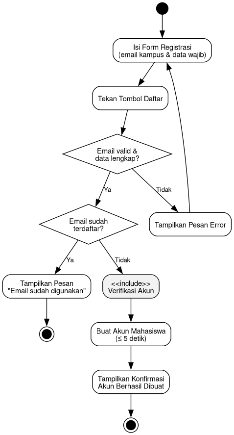

*Gambar — Activity Diagram UC-1 Daftar Akun*

### UC-3 — Kelola Profil & Preferensi Kebugaran

*Aktor: Mahasiswa    |    Kebutuhan Fungsional Terkait: FR-1.3, FR-1.4*

**Basic Flow**

1. Mahasiswa membuka halaman profil kebugaran.

2. Mahasiswa mengisi tujuan kebugaran, tingkat pengalaman, jenis latihan yang disukai, dan lokasi gym pilihan.

3. Mahasiswa menambahkan minimal satu slot ketersediaan mingguan (hari, waktu mulai, waktu selesai).

4. Mahasiswa menekan tombol “Simpan”.

5. Sistem memvalidasi kelengkapan data profil dan slot waktu.

6. Sistem menyimpan data profil dalam waktu maksimal 3 detik.

7. Sistem menampilkan profil yang sudah diperbarui.

**Alternative Flow — Mengedit profil yang sudah ada**

1. Sistem memuat data profil lama ke form sebelum diedit.

2. Mahasiswa mengubah data yang diinginkan, lalu melanjutkan ke langkah 4 pada alur normal.

**Exception Flow — Slot waktu tidak valid**

1. Sistem mendeteksi waktu selesai lebih awal dari waktu mulai.

2. Sistem menolak slot dan menampilkan pesan error.

**Activity Diagram**

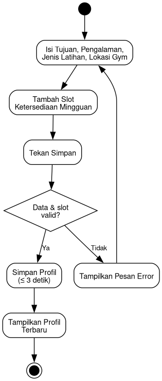

*Gambar — Activity Diagram UC-3 Kelola Profil & Preferensi Kebugaran*

### UC-4 — Cari Rekomendasi Teman Latihan

*Aktor: Mahasiswa    |    Kebutuhan Fungsional Terkait: FR-2.1, FR-2.2*

**Basic Flow**

1. Mahasiswa membuka halaman pencarian teman latihan.

2. Mahasiswa menekan tombol “Cari Kecocokan Baru”.

3. Sistem menjalankan use case Hitung Skor Kecocokan («include») untuk setiap kandidat.

4. Sistem mengurutkan kandidat berdasarkan skor kecocokan tertinggi.

5. Sistem menampilkan hingga 10 rekomendasi dalam waktu maksimal 5 detik.

6. Mahasiswa meninjau daftar rekomendasi.

**Alternative Flow — Tidak ada kandidat yang cocok**

1. Sistem menampilkan daftar kosong beserta saran untuk melengkapi preferensi profil.

**Exception Flow — Permintaan gagal diproses (timeout server)**

1. Sistem menampilkan pesan gagal memuat rekomendasi.

2. Mahasiswa dapat menekan tombol coba lagi untuk mengulang use case.

**Activity Diagram**

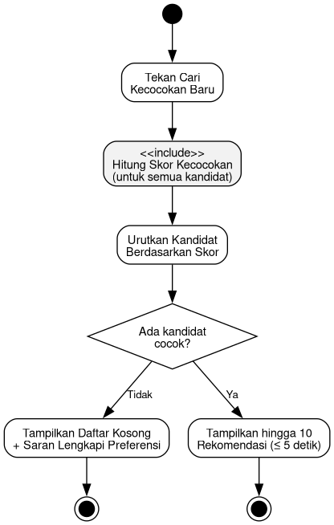

*Gambar — Activity Diagram UC-4 Cari Rekomendasi Teman Latihan*

### UC-5 — Kirim & Kelola Permintaan Pertemanan

*Aktor: Mahasiswa    |    Kebutuhan Fungsional Terkait: FR-2.3, FR-2.4*

**Basic Flow**

1. Mahasiswa memilih kandidat dari daftar rekomendasi.

2. Mahasiswa menekan tombol “Kirim Permintaan” dan mengonfirmasinya.

3. Sistem mengirim permintaan pertemanan dalam waktu maksimal 3 detik.

4. Sistem menampilkan status permintaan sebagai “Menunggu”.

5. Mahasiswa penerima menerima notifikasi permintaan masuk.

6. Mahasiswa penerima menekan tombol “Terima”.

7. Sistem membuat kecocokan timbal balik (matched) dalam waktu maksimal 3 detik.

8. Sistem menampilkan status “Matched” ke kedua pengguna.

**Alternative Flow — Penerima menolak permintaan**

1. Mahasiswa penerima menekan tombol “Tolak”.

2. Sistem menandai status permintaan “Ditolak” dan permintaan tidak aktif lagi.

**Exception Flow — Permintaan duplikat**

1. Sistem mendeteksi permintaan serupa sudah pernah dikirim dan masih pending.

2. Sistem menampilkan pesan “Permintaan sudah terkirim, menunggu respons”.

**Activity Diagram**

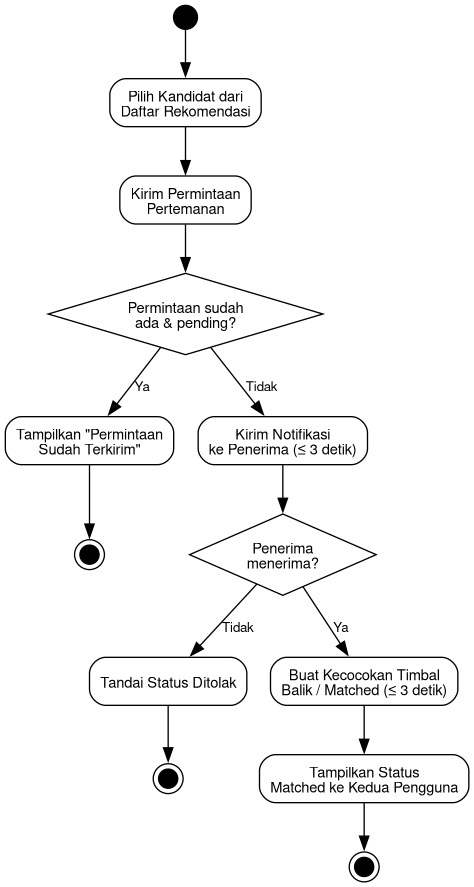

*Gambar — Activity Diagram UC-5 Kirim & Kelola Permintaan Pertemanan*

### UC-6 — Jadwalkan Sesi Latihan Bersama

*Aktor: Mahasiswa    |    Kebutuhan Fungsional Terkait: FR-2.6*

**Basic Flow**

1. Mahasiswa yang sudah matched membuka halaman jadwal sesi.

2. Mahasiswa memilih lokasi gym, tanggal, dan waktu latihan.

3. Mahasiswa mengirim usulan jadwal ke buddy.

4. Buddy meninjau usulan jadwal.

5. Buddy mengonfirmasi lokasi, tanggal, dan waktu.

6. Sistem membuat sesi latihan dalam waktu maksimal 3 detik.

7. Sistem menampilkan sesi terjadwal ke kedua pengguna.

**Alternative Flow — Buddy mengusulkan perubahan waktu**

1. Buddy menekan tombol “Usulkan Waktu Lain” beserta usulan baru.

2. Use case kembali ke langkah 2 dengan usulan baru dari buddy.

**Exception Flow — Salah satu pihak membatalkan sebelum konfirmasi**

1. Sistem membatalkan proses penjadwalan.

2. Sistem memberi tahu pihak lain bahwa usulan dibatalkan.

**Activity Diagram**

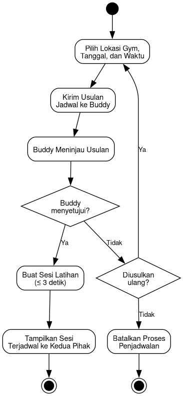

*Gambar — Activity Diagram UC-6 Jadwalkan Sesi Latihan Bersama*

### UC-7 — Kirim Pesan ke Teman Latihan

*Aktor: Mahasiswa    |    Kebutuhan Fungsional Terkait: FR-2.5*

**Basic Flow**

1. Mahasiswa membuka ruang obrolan dengan buddy yang sudah matched.

2. Mahasiswa mengetik pesan dan menekan tombol “Kirim”.

3. Sistem mengaktifkan fitur pesan dalam waktu maksimal 2 detik setelah matched.

4. Sistem mengirim pesan ke buddy secara real-time.

5. Buddy menerima dan membaca pesan.

**Alternative Flow — Mahasiswa memicu tindakan opsional (extension point)**

1. Pada langkah 5, jika interaksi terasa tidak nyaman atau konten tidak pantas, mahasiswa dapat memicu use case Blokir Pengguna («extend») atau Laporkan Pengguna («extend»).

**Exception Flow — Buddy sudah memblokir mahasiswa**

1. Sistem menolak pengiriman pesan.

2. Sistem menampilkan pesan gagal terkirim kepada mahasiswa.

**Activity Diagram**

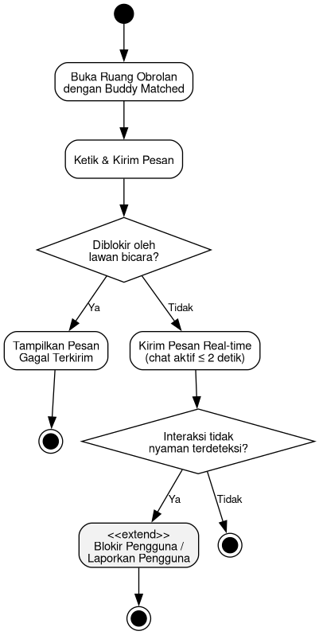

*Gambar — Activity Diagram UC-7 Kirim Pesan ke Teman Latihan*

### UC-8 — Kelola Operasional Gym

*Aktor: Pengelola Gym    |    Kebutuhan Fungsional Terkait: System Scope*

**Basic Flow**

1. Pengelola Gym login ke panel operator.

2. Pengelola Gym membuka menu Informasi Gym.

3. Pengelola Gym memperbarui jam operasional, kapasitas, dan status gym (buka/tutup/tidak tersedia).

4. Pengelola Gym menekan tombol “Simpan”.

5. Sistem memvalidasi data yang dimasukkan.

6. Sistem menyimpan pembaruan informasi gym.

7. Sistem menampilkan informasi gym terbaru kepada mahasiswa.

**Alternative Flow — Mengirim pengumuman operasional**

1. Pengelola Gym memilih untuk mengirim pengumuman tambahan.

2. Sistem mengirimkan notifikasi pengumuman ke mahasiswa terkait.

**Exception Flow — Data kapasitas tidak valid**

1. Sistem mendeteksi nilai kapasitas negatif atau bukan angka.

2. Sistem menolak penyimpanan dan menampilkan pesan error.

**Activity Diagram**

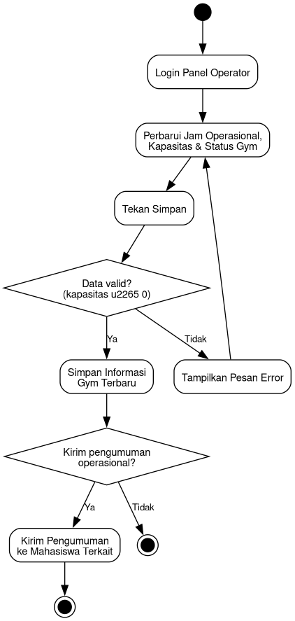

*Gambar — Activity Diagram UC-8 Kelola Operasional Gym*

### UC-9 — Verifikasi & Moderasi Pengguna

*Aktor: Administrator Sistem    |    Kebutuhan Fungsional Terkait: System Scope*

**Basic Flow**

1. Administrator login ke dashboard admin.

2. Administrator membuka daftar akun menunggu verifikasi atau daftar laporan masuk.

3. Administrator meninjau data mahasiswa atau detail laporan.

4. Administrator memutuskan tindakan: verifikasi akun, tangguhkan akun, atau hapus konten.

5. Sistem menjalankan tindakan yang dipilih dan mencatatnya ke audit log.

6. Sistem memperbarui status akun/konten terkait.

**Alternative Flow — Laporan ditandai tidak valid**

1. Administrator memilih “Tidak Valid” pada laporan yang ditinjau.

2. Sistem menutup laporan tanpa tindakan terhadap akun terlapor.

**Exception Flow — Data akun/laporan tidak ditemukan**

1. Sistem mendeteksi data sudah dihapus atau berubah sejak daftar dimuat.

2. Sistem menampilkan pesan error dan mengembalikan administrator ke daftar.

**Activity Diagram**

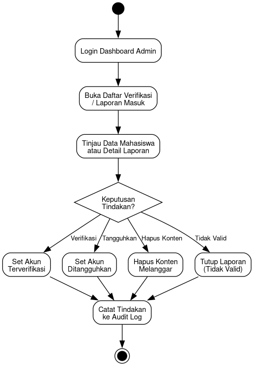

*Gambar — Activity Diagram UC-9 Verifikasi & Moderasi Pengguna*

## C.1 Activity Diagram Use Case Tambahan (Target Include/Extend)

Empat use case berikut muncul sebagai target relasi «include»/«extend» pada diagram use case (Bagian A), dan tetap dilengkapi activity diagram sesuai standar OMG meski alurnya lebih ringkas.

### UC-2 — Verifikasi Akun (sub-proses «include» dari UC-1)

**Basic Flow**

1. Sistem mengirim kode OTP ke email kampus mahasiswa.

2. Mahasiswa memasukkan kode OTP.

3. Sistem memvalidasi kode OTP dalam waktu maksimal 10 detik.

4. Sistem menandai akun sebagai terverifikasi.

*Exception: kode OTP salah/kedaluwarsa → sistem menampilkan error dan menawarkan kirim ulang kode.*

**Activity Diagram**

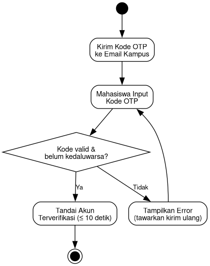

*Gambar — Activity Diagram UC-2 Verifikasi Akun (sub-proses «include» dari UC-1)*

### UC-4b — Hitung Skor Kecocokan (sub-proses «include» dari UC-4)

**Basic Flow**

1. Sistem mengambil data kedua profil pengguna.

2. Sistem membandingkan lima faktor: waktu ketersediaan, tujuan kebugaran, preferensi latihan, tingkat pengalaman, dan jam gym pilihan.

3. Sistem menghitung skor total kecocokan.

4. Sistem mengembalikan skor ke proses pemanggil (UC-4).

**Activity Diagram**

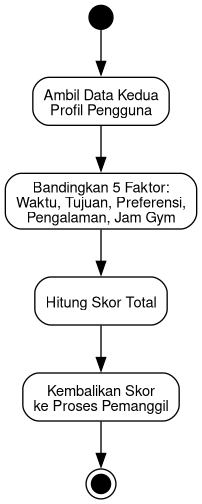

*Gambar — Activity Diagram UC-4b Hitung Skor Kecocokan (sub-proses «include» dari UC-4)*

### UC-7b — Blokir Pengguna («extend» dari UC-7)

**Basic Flow**

1. Mahasiswa menekan tombol “Blokir” pada profil/obrolan buddy.

2. Mahasiswa mengonfirmasi aksi blokir.

3. Sistem mencegah interaksi profil dan pesan lebih lanjut dalam waktu maksimal 2 detik.

4. Sistem menampilkan konfirmasi pengguna telah diblokir.

**Activity Diagram**

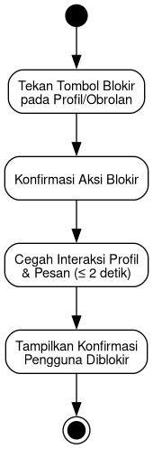

*Gambar — Activity Diagram UC-7b Blokir Pengguna («extend» dari UC-7)*

### UC-7c — Laporkan Pengguna («extend» dari UC-7)

**Basic Flow**

1. Mahasiswa menekan tombol “Laporkan”.

2. Mahasiswa mengisi alasan dan deskripsi laporan.

3. Mahasiswa menekan tombol submit.

4. Sistem mencatat laporan dan memberi tahu administrator dalam waktu maksimal 5 detik.

*Exception: alasan/deskripsi kosong → sistem menolak submit dan meminta data dilengkapi.*

**Activity Diagram**

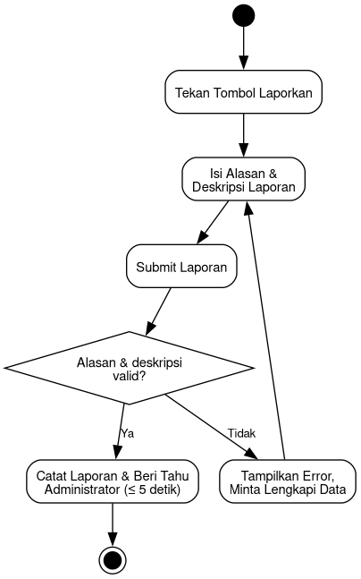

*Gambar — Activity Diagram UC-7c Laporkan Pengguna («extend» dari UC-7)*
